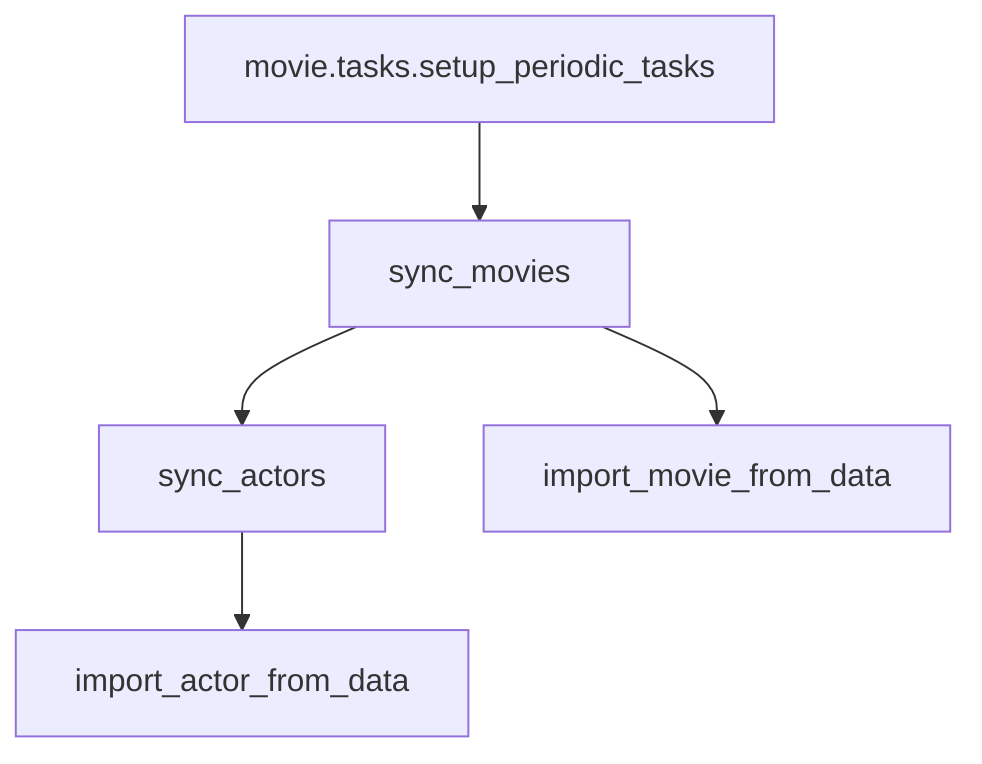

# GhibliMovies 🎬
 [](https://gitlab.com/mastizada/ghiblimovies/-/pipelines) 
 [](https://mastizada.gitlab.io/ghiblimovies/) 

GhibliMovies is a simple application that syncs movies and actors from the Ghibli Studios and displays them in a list.

---

## Install

### Docker
The easiest way to start all services is by using the docker-compose option.

#### Prerequisites
* docker 19.03.13+ (version recommended).
* docker-compose 1.27.4+ (version recommended).

#### Setup the project

After installing these 2 prerequisites, setup the application using these commands:
```shell
# Clone the repository
$ git clone https://gitlab.com/mastizada/ghiblimovies.git
# Go to the project directory
$ cd ghiblimovies
# Create the configuration file from the template
$ cp .env.template .env
# Start services with docker-compose
$ docker-compose up --build
```

This will build the application with all its requirements and services (PostgreSQL and Redis),
start background tasks with Celery, and enable the frontend on [127.0.0.1:8000](http://127.0.0.1:8000) address.

Admin interface of the application can be accessed on [127.0.0.1:8000/admin/](http://127.0.0.1:8000/admin/) with a default username/password as `admin/admin`.

### Local setup
#### Prerequisites

Building GhibliMovies requires these prerequisites:

* [poetry](https://python-poetry.org/) package manager.
* `gcc` compiler
* `libffi-dev` library
* `musl-dev` library
* `postgresql-dev` package
* Python 3.8+

#### Setup the project

After installing build dependencies, use these command to set up the project:

```bash
# Clone the repository
$ git clone https://gitlab.com/mastizada/ghiblimovies.git
# Go to the project directory
$ cd ghiblimovies
# Install project dependencies
$ poetry install
# Activate the work environment
$ poetry shell
# For now, you can continue with a default configuration, learn more about configuration options under the "Configuration" section.
# Initialize the database
$ ./manage.py migrate
# Create a superuser (this step is optional, it is needed for the admin page).
$ ./manage.py createsuperuser
```

You can test your installation using the `./manage.py test` command.

You are finally ready to run the application 🚀.

Start the application anytime by using this command inside the project directory:
```bash
$ poetry run python manage.py runserver
```
This will start the application on [127.0.0.1:8000](http://127.0.0.1:8000) and admin page will be available on [127.0.0.1:8000/admin/](http://127.0.0.1:8000/admin/).

For background tasks, you will need to start the Celery worker:
```bash
# Start the worker:
$ poetry run celery -A ghiblimovies worker -l INFO
# For periodic sync with the API, start the celery-beat worker:
$ poetry run celery -A ghiblimovies beat -l INFO --scheduler django_celery_beat.schedulers:DatabaseScheduler
```

## Configuration

The project uses the `.env` file for the configuration. Each parameter can also be overwritten using environment variables.

The `.env.template` file contains configuration for the Docker-Compose setup.

For a Local setup, you can create a `.env` text file and overwrite any supported configuration options.

### Supported configuration options

Configuration options and their default values:

* `DEBUG` - Debug mode for local development. Default: `off`
* `SECRET_KEY` - A secret key, you can use an [online](https://miniwebtool.com/django-secret-key-generator/) tool to generate it. It is very important to change its value in the production. Default: `NotSo@Secret`
* `ALLOWED_HOSTS` - A comma separated list of addresses that can access the website. Default: `127.0.0.1`
* `DATABASE_URL` - An SQLite database, you can change it to another database using [URL Schema](https://github.com/jacobian/dj-database-url#url-schema). Default: `sqlite:///./db.sqlite3`
* `USE_TZ` - [Timezone](https://docs.djangoproject.com/en/3.1/topics/i18n/timezones/). Default: `on`
* `TIME_ZONE` - Selected timezone. Default: `UTC`
* `USE_I18N` - [Internationalization](https://docs.djangoproject.com/en/3.1/topics/i18n/). Default: `on`
* `USE_L10N` - [Localization](https://docs.djangoproject.com/en/3.1/topics/i18n/). Default: `on`
* `CACHE_URL` - [Django's cache framework](https://docs.djangoproject.com/en/3.1/topics/cache/), it can be changed to redis using the `redis://127.0.0.1:6379/0` value for example (requires `redis` package). Default: `dummycache://`
* `CELERY_CACHE_BACKEND` - Cache backend for storing task metadata for celery. Default: `django-cache`
* `CELERY_BROKER_URL` - A messaging queue for the celery worker. You can use Rabbitmq (requires rabbitmq package) in the production. Default: `memory://`
* `CELERY_TASK_ALWAYS_EAGER` - Run celery tasks directly in the application instead of sending to a background worker. Running the worker is not needed when the value is `on`. Default: `on`
* `SENTRY_DSN` - [Sentry](https://sentry.io) DSN for error reporting in the production. Default: `None`
* `MOVIES_API_BASE` - API for the sync of movies and actors. Default: `https://ghibliapi.herokuapp.com/`

These 3 parameters are used for the `./manage.py initadmin` command in the Docker-Compose:
* `DEFAULT_ADMIN_USERNAME` - user username for login. Default: `admin`
* `DEFAULT_ADMIN_PASS` - user password for login. Default: `admin`
* `DEFAULT_ADMIN_EMAIL` - user email. Default: `admin@debugwith.me`

## Sync flow


## Live preview

You can check the live preview of this application on [movies.debugwith.me](https://movies.debugwith.me).
